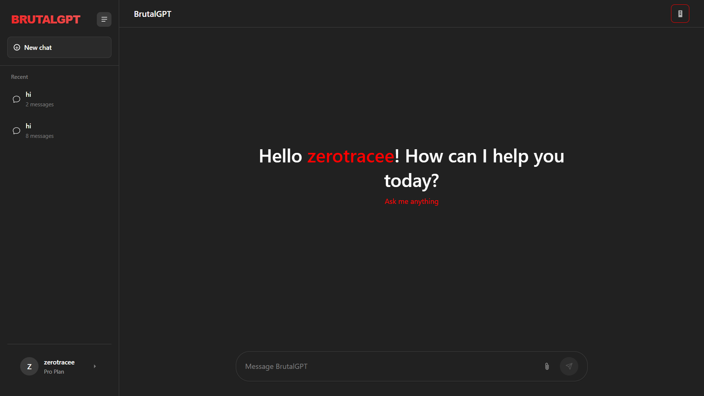

# BrutalGPT - Next-Gen Uncensored AI Chatbot

A next-gen uncensored AI chatbot for cybersecurity and coding. Built for unrestricted conversations, raw code generation, and advanced security research. Ideal for experts who need full control, freedom, and power beyond standard AI limits.


## Features

- 🛡️ **Cybersecurity Focus**: Designed specifically for security research and analysis
- 💻 **Raw Code Generation**: Generate unrestricted code for various programming languages
- 🔓 **Uncensored Conversations**: Engage in unrestricted dialogue without standard AI limitations
- 🧠 **Advanced Security Research**: Tools and capabilities for expert-level security analysis
- 🎯 **Expert Control**: Full control and freedom for advanced users
- 🌙 **Dark/Light Mode**: Toggle between dark and light themes
- 💬 **Chat History**: Save and load previous conversations
- 📁 **File Attachments**: Support for image and document uploads
- 🎨 **Responsive Design**: Works on mobile, tablet, and desktop
- 🧪 **Simulated AI Responses**: Intelligent simulated responses when API key is not provided
- 🔧 **Code Mode**: Specialized mode for Python code generation with syntax highlighting
- 🎯 **Sidebar Navigation**: Collapsible sidebar for better screen utilization
- 📋 **Message Actions**: Copy, regenerate, and manage messages
- 🔐 **Secure API Integration**: Connect to OpenRouter API through a local proxy for enhanced security

## Demo



## Getting Started

### Prerequisites

- Node.js (v14 or higher)
- A modern web browser (Chrome, Firefox, Safari, Edge)
- OpenRouter API key for real AI responses

### Installation

1. Clone the repository:
   ```bash
   git clone https://github.com/jagbiryadav/brutalgpt.git
   ```

2. Navigate to the project directory:
   ```bash
   cd brutalgpt
   ```

3. Install dependencies:
   ```bash
   npm install express node-fetch dotenv
   ```

4. Configure your OpenRouter API key:
   - Copy `.env.example` to `.env`:
     ```bash
     cp .env.example .env
     ```
   - Edit `.env` and replace `sk-REPLACE_WITH_YOUR_KEY` with your actual OpenRouter API key

### Running the Application

1. Start the local proxy server:
   ```bash
   node server.js
   ```

2. Open your browser and navigate to:
   ```
   http://localhost:3000
   ```

3. Enter your name in the onboarding screen
4. Optionally add your OpenRouter API key for real AI responses (stored only in memory, never saved)
5. Click "Start Chatting"

## Usage

1. **Chatting**:
   - Type your message in the input field at the bottom
   - Press Enter or click the send button to submit
   - Toggle between chat mode and code mode using the code icon in the header

2. **File Attachments**:
   - Click the paperclip icon to attach files
   - Select image or document files to upload
   - Attached files will be shown in the chat

3. **Managing Chats**:
   - Create new chats with the "New chat" button
   - View chat history in the sidebar
   - Rename or delete chats using the action buttons
   - Toggle sidebar collapse using the menu icon

4. **Theme Switching**:
   - Switch between dark and light mode in your profile settings
   - Use Ctrl+D as a keyboard shortcut

## Security

**Important Security Notice**: 
This refactored version now uses a secure local proxy server to handle API requests. Your OpenRouter API key is:
- Never stored in browser localStorage or sessionStorage
- Never hardcoded in client-side files
- Only loaded into memory at runtime
- Kept secure on the server side in the `.env` file

**Best Security Practices**:
- Never hardcode or store your API keys in browser or repository
- Rotate your API keys regularly
- Keep your `.env` file secure and never commit it to version control
- Use the local proxy server to prevent exposing your API key to the client-side

## API Integration

To use real AI responses instead of simulated ones:

1. Get an API key from [OpenRouter](https://openrouter.ai/)
2. Add your API key to the `.env` file (server-side, secure)
3. The application will automatically use the local proxy to communicate with OpenRouter

## Project Structure

```
.
├── index.html          # Main HTML file (client-side)
├── server.js           # Local proxy server (server-side)
├── .env.example        # Example environment variables
├── .gitignore          # Git ignore file
├── css/
│   ├── root-c1znbk8k.css     # Core styles
│   └── conversation-small-chy8jwv7.css  # Conversation styles
├── images/
│   ├── favicon-eex17e9e.ico
│   ├── favicon-l4nq08hd.svg
│   ├── favicon-180x180-od45eci6.webp
│   └── brutalgpt.png
└── README.md           # This file
```

## Key Components

### User Interface
- **Sidebar**: Contains chat history and user profile
- **Main Chat Area**: Displays conversation between user and AI
- **Composer**: Input area for typing messages and attaching files
- **Welcome Screen**: Initial screen with suggestions for new users

### Core Functionality
- **Message Management**: Send, receive, and store chat messages
- **Chat History**: Local storage of conversations
- **Theme Management**: Dark/light mode switching
- **File Handling**: Image and document attachment support
- **Secure API Integration**: OpenRouter API connectivity through local proxy

### Special Features
- **Code Mode**: Dedicated mode for Python code generation with syntax highlighting
- **Simulated Responses**: Intelligent AI-like responses when API is not available
- **Responsive Design**: Adapts to different screen sizes
- **Keyboard Shortcuts**: Ctrl+D for theme toggle

## Browser Support

- Chrome (latest)
- Firefox (latest)
- Safari (latest)
- Edge (latest)

## Development

This project is built with:
- Vanilla HTML, CSS, and JavaScript for the frontend
- Node.js with Express for the local proxy server
- dotenv for environment variable management

To modify the project:
1. Edit `index.html` to change the UI or frontend functionality
2. Modify `server.js` to change the proxy server behavior
3. Update CSS styles within the `<style>` tags in `index.html`
4. Update JavaScript functions as needed

## Contributing

Contributions are welcome! Please feel free to submit a Pull Request.

1. Fork the repository
2. Create your feature branch (`git checkout -b feature/AmazingFeature`)
3. Commit your changes (`git commit -m 'Add some AmazingFeature'`)
4. Push to the branch (`git push origin feature/AmazingFeature`)
5. Open a Pull Request

## License

This project is licensed under the MIT License - see the [LICENSE](LICENSE) file for details.

## Acknowledgments

- Inspired by OpenAI's ChatGPT interface
- Uses OpenRouter API for AI capabilities
- Icons from various open-source libraries

## Author

Jagbir yadav - Python & frontend Developer

GitHub: @jagbiryadav
LinkedIn: @jagbir-yadav


## Disclaimer

This is a frontend clone project for educational purposes. It is not affiliated with OpenAI or ChatGPT. The simulated AI responses are generated locally and are not powered by any real AI model unless an API key is provided. This tool is designed for cybersecurity and coding professionals who require unrestricted capabilities for legitimate research and development purposes.

